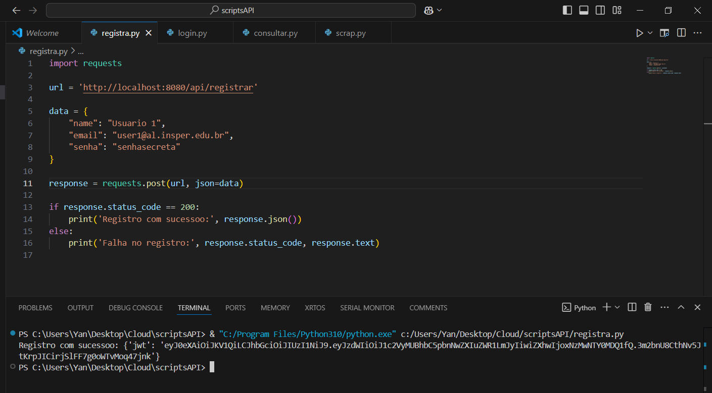
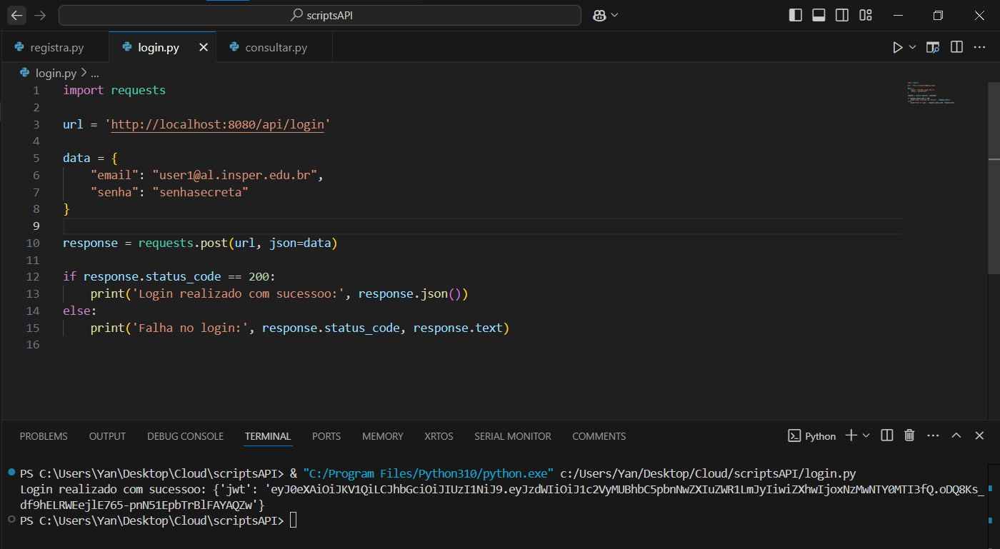
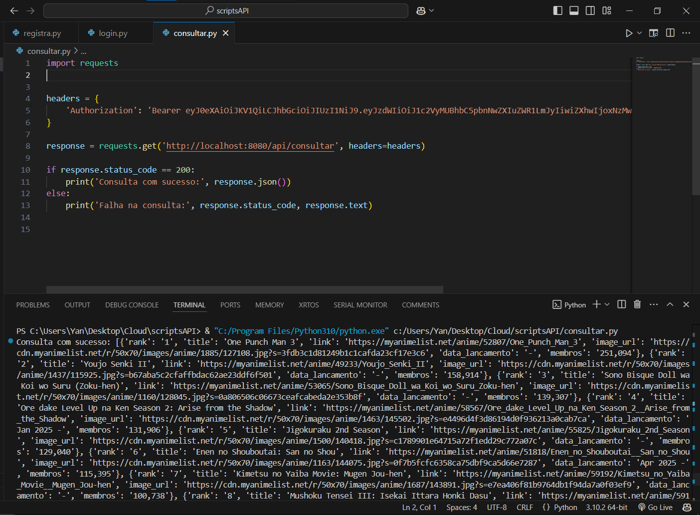

### Base URL

A API pode ser acessada localmente pela URL base: `http://localhost:8080/api`

---


## Endpoints

### 1. Registro de Usuário
**Endpoint:** `/registrar`  (localhost:8080/api/registrar)  
**Método:** `POST`  
**Descrição:** Cria um novo usuário e retorna um token JWT de autenticação.

#### Corpo da Requisição

```json
{
    "name": "string",
    "email": "string",
    "senha": "string"
}
```

#### Resposta de Sucesso
```json
{
    "jwt": "string"
}
```
- **jwt**: Token JWT de autenticação para o usuário registrado.


---

### 2. Login do Usuário
**Endpoint:** `/login`  (localhost:8080/api/login)  
**Método:** `POST`  
**Descrição:** Autentica o usuário com email e senha, retornando um token JWT para acesso autorizado.

#### Corpo da Requisição

```json
{
    "email": "string",
    "senha": "string"
}
```


#### Resposta de Sucesso
```json
{
    "jwt": "string"
}
```
**jwt**: Token JWT de autenticação para o usuário autenticado.


---

### 3. Consulta de Animes
**Endpoint:** `/consultar`  (localhost:8080/api/consultar)  
**Método:** `GET`  
**Descrição:** Retorna a lista dos 50 animes mais aguardados, obtida via scraping do MyAnimeList.

#### Cabeçalho da Requisição
- **Authorization**: `"Bearer <token_jwt>"` (Token JWT obtido no registro ou login)

#### Resposta de Sucesso
```json
[  
    {
        "rank": "integer",
        "title": "string",
        "link": "string",
        "image_url": "string",
        "data_lancamento": "string",
        "membros": "string"
    },
    ...
]
```

- **rank**: Posição do anime na lista.
- **title**: Título do anime.
- **link**: Link direto para o MyAnimeList.
- **image_url**: URL da capa do anime.
- **data_lancamento**: Data de lançamento.
- **membros**: Quantidade de membros que favoritaram o anime.

