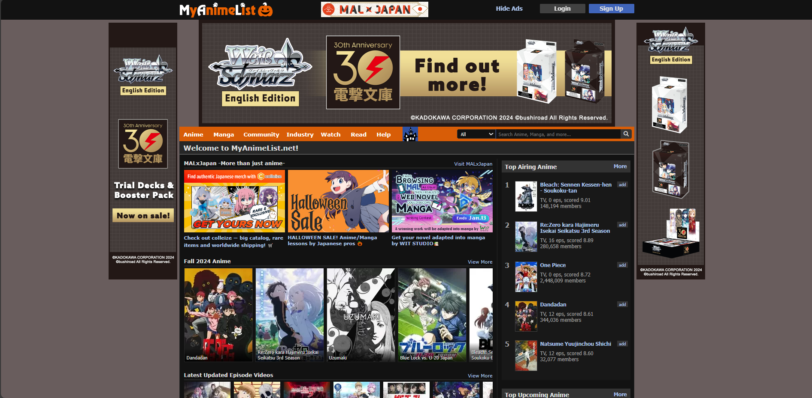

# APIRestful dos principais animes em lançamento no MyAnimeList

## O que é o MyAnimeList?
**MyAnimeList** (MAL) é uma rede social voltada para fãs de animes e mangás, com o objetivo de oferecer um espaço para que os usuários possam criar listas pessoais, catalogando e classificando as obras de acordo com suas avaliações. Além de facilitar a descoberta de usuários com gostos similares, o MAL proporciona acesso a um vasto banco de dados sobre animes e mangás.

Em 2015, o MyAnimeList recebeu cerca de 120 milhões de visitantes mensais, consolidando-se como uma das maiores plataformas de anime e mangá.  
Saiba mais na [Wikipédia](https://pt.wikipedia.org/wiki/MyAnimeList).

## Funcionalidades da API

A API utiliza web scraping para coletar dados dos principais animes em lançamento na página do MyAnimeList, focando nos 50 animes com maior número de membros que os favoritaram. A partir dessa coleta, a API retorna as seguintes informações para cada anime:

- **rank**: Posição do anime na lista de lançamentos em número de membros.
- **title**: Título do anime.
- **link**: Link direto para a página do anime no MyAnimeList.
- **image_url**: URL da imagem de capa do anime.
- **data_lancamento**: Data prevista para o lançamento do anime.
- **membros**: Quantidade de membros que favoritaram o anime.

---

